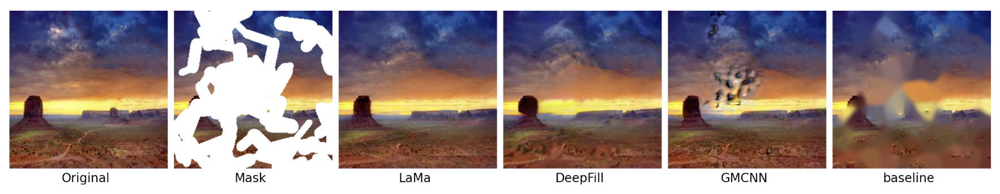
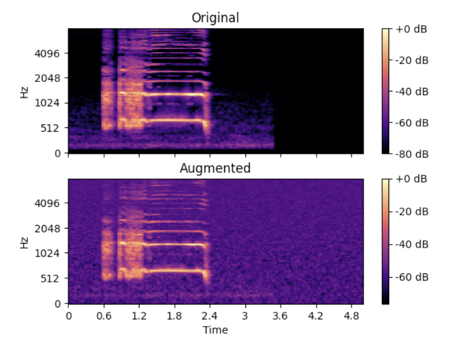
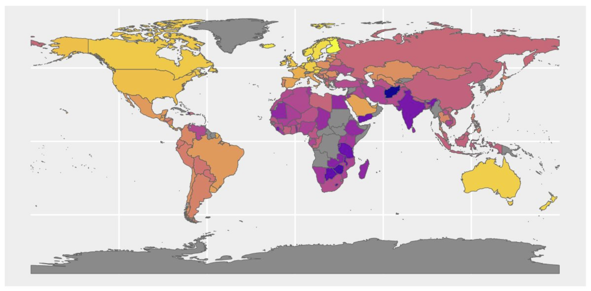

# University Course Projects

A collection of presentations and reports from three university course projects completed as part of the Data Science program at the University of Padova.

---

## 1. Image Inpainting: Comparison and Evaluation of Different Architectures

**Course:** Computer Vision

This project provides a systematic comparison of image inpainting approaches, ranging from a classical computer vision baseline to state-of-the-art deep learning models. The models evaluated are: **GMCNN**, **DeepFill v2** and **LaMa** (based on Fast Fourier Convolutions). All models were tested on the Places2 dataset using four mask types (rectangular, stroke, random noise, mosaic) at seven coverage levels (5%–60%), and evaluated using NRMSE, SSIM, PSNR, and LPIPS metrics. LaMa consistently outperformed all other models across mask types and sizes, with its image-wide receptive field — enabled by Fast Fourier Convolutions — proving particularly effective for large corrupted regions.

  
  
<em>Side by side comparison of the outputs of the four models for a stroke mask that hides 60% of the original image</em>

---

## 2. Data Augmentation for Environmental Sound Classification

**Course:** Machine Learning for Human Data (MLHD)

This project investigates the effectiveness of audio-based data augmentation techniques for classifying short environmental sound clips from the ESC-10 dataset, a challenging benchmark due to its limited number of samples (400 clips across 10 classes). Raw audio files were processed into Log Mel Spectrograms and their temporal derivatives, which were then used as input to two CNN architectures: a standard Baseline CNN and a more advanced MelNet. Two augmentation schemas (A1, A2) were designed and evaluated, varying techniques such as time stretching, pitch shifting, Gaussian noise addition, and audio shifting. The best result was achieved by the MelNet architecture combined with the more aggressive augmentation schema (A2), confirming that data augmentation can be a valuable strategy when working with small audio datasets.

  
  
<em>Log Mel-Spectrogram Augmentation</em>

---

## 3. World Happiness Report: Statistical Analysis

**Course:** Statistical Learning

This project analyses the determinants of national happiness using data from the World Happiness Report 2021 and World Data 2021, merged into a dataset of 138 countries and 18 features. The goal was to identify which social, economic and demographic factors most strongly predict a country's happiness score. After exploratory data analysis — including correlation analysis, density plots and scatterplots — several regression approaches were compared: forward and backward stepwise selection, Ridge regression and Lasso regression. The final model, selected via test MSE, was the stepwise model (MSE: 0.267, Adjusted R²: 0.735). The key finding is that, while GDP is correlated with happiness, the strongest predictors are **social support** and **freedom to make life choices**, suggesting that human relationships and personal autonomy matter more than wealth alone.

  
  
<em>Infographic Map on Happiness Score</em>

---
